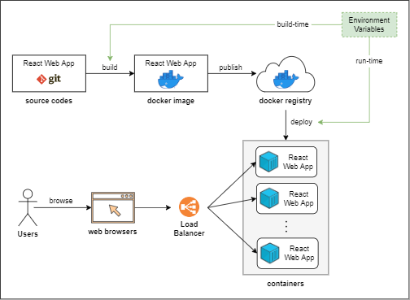

# Exploration on deploying React Web App in Production

This project is to explore how to deploy a React web application in production. The exploration will cover the following:

- How to containerize the React web application
- How to automate build + publish with Kaniko
- How to set environment variables for different deployment environments (Run-time vs Build-time)

The diagram below is an overview of what we are trying to achieve.



## Usage

This section will cover how to dockerize a React web application and serve it with Nginx/Node servers.

### Nginx Version

1. Build the docker image
    ```bash
    docker build -f Dockerfile.nginx -t react-nginx:latest .
    yes | docker image prune --filter label=stage=builder
    ```
2. Deploy the web application

    ```bash
    docker run -it --rm -p 3000:3000 react-nginx:latest
    ```

### Node Version

1. Build the docker image
    ```bash
    docker build -f Dockerfile.node -t react-node:latest .
    ```
2. Deploy the web application

    ```bash
    docker run -it --rm -p 3000:3000 react-node:latest
    ```

## Summary

1. Nginx vs Node image
    - nginx container image is much smaller and faster.
    - nginx uses the static build which makes it hard to replace environment variables in run-time.
2. Set environment variables in run-time.
    - Node: 
    - Nginx: 

## References

- Dockerize React App
  - [https://mherman.org/blog/dockerizing-a-react-app/](https://mherman.org/blog/dockerizing-a-react-app/)
- Run-Time Environment Variables
  - [https://dev.to/eslynn/how-to-dynamically-change-your-react-environment-variables-without-re-building-55el](https://dev.to/eslynn/how-to-dynamically-change-your-react-environment-variables-without-re-building-55el)
  - [https://www.bencode.net/posts/react-build/](https://www.bencode.net/posts/react-build/)
  - [https://developers.redhat.com/blog/2021/03/04/making-environment-variables-accessible-in-front-end-containers#multi_stage_build_containers](https://developers.redhat.com/blog/2021/03/04/making-environment-variables-accessible-in-front-end-containers#multi_stage_build_containers)
  - [https://www.freecodecamp.org/news/how-to-implement-runtime-environment-variables-with-create-react-app-docker-and-nginx-7f9d42a91d70/](https://www.freecodecamp.org/news/how-to-implement-runtime-environment-variables-with-create-react-app-docker-and-nginx-7f9d42a91d70/)
  - [https://blog.risingstack.com/create-react-app-runtime-env-cra/](https://blog.risingstack.com/create-react-app-runtime-env-cra/)
  - [https://sinclert.github.io/react-env-vars/](https://sinclert.github.io/react-env-vars/)
